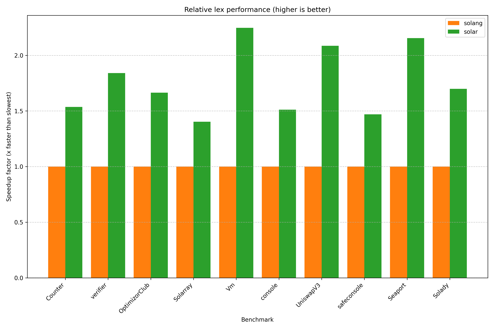

# solar-bench

Simple benchmarks across different Solidity parser implementations.

Requires cloning submodules: `git submodule update --init --checkout`.

Run with:

```bash
# Criterion
cargo bench -p solar-bench --bench criterion -- --quiet --format terse parser |& tee benches/criterion.out
uv --project benches/analyze run benches/analyze/main.py benches/README.md < benches/criterion.out

# iai - requires `valgrind` and `iai-callgrind-runner`
cargo bench -p solar-bench --bench iai
```

Currently this takes around 30 minutes to complete: `sources (12) * parsers (5) * lexers (2) * 15s`.

This crate is excluded from the main workspace to avoid compiling it (and its dependencies) when
invoking other commands such as `cargo test`.

## Results

You can view the Solar-only results on [codspeed.io](https://codspeed.io/paradigmxyz/solar).

The following results were achieved on:
- Target: `x86_64-unknown-linux-gnu`
- CPU: AMD Ryzen 9 5950X
- Versions:
  - [`solc 0.8.30`](https://github.com/argotorg/solidity)
  - [`solar 0.1.8`](../README.md)
  - [`solang-parser 0.3.4`](https://crates.io/crates/solang-parser)
  - [`slang 0.18.3`](https://crates.io/crates/slang)
  - [`tree-sitter 0.25.4`](https://crates.io/crates/tree-sitter), [`tree-sitter-solidity 1.2.11`](https://crates.io/crates/tree-sitter-solidity)

<!-- AUTOGENERATED MARKER -->




### empty (0 LoC, 0 bytes)

#### Lex
| Parser   | Relative   | Time      | LoC/s   | Bytes/s   |
|:---------|:-----------|:----------|:--------|:----------|
| solang   | 21.64x     | 11.732 ns | N/A     | N/A       |
| solar    | 1.00x      | 238.29 ns | N/A     | N/A       |

#### Parse
| Parser      | Relative   | Time      | LoC/s   | Bytes/s   |
|:------------|:-----------|:----------|:--------|:----------|
| solang      | 37.74x     | 104.35 ns | N/A     | N/A       |
| tree-sitter | 6.36x      | 617.88 ns | N/A     | N/A       |
| solar       | 4.01x      | 979.37 ns | N/A     | N/A       |
| solc        | 3.92x      | 1.0000 µs | N/A     | N/A       |
| slang       | 1.00x      | 3.9255 µs | N/A     | N/A       |

#### Lower
| Parser   | Relative   | Time      | LoC/s   | Bytes/s   |
|:---------|:-----------|:----------|:--------|:----------|
| solar    | 1.00x      | 5.1668 µs | N/A     | N/A       |

### Counter (14 LoC, 258 bytes)

#### Lex
| Parser   | Relative   | Time      | LoC/s   | Bytes/s   |
|:---------|:-----------|:----------|:--------|:----------|
| solang   | 2.36x      | 1.7589 µs | 7.96M   | 146.76M   |
| solar    | 1.00x      | 4.1441 µs | 3.38M   | 62.26M    |

#### Parse
| Parser      | Relative   | Time      | LoC/s   | Bytes/s   |
|:------------|:-----------|:----------|:--------|:----------|
| solar       | 32.88x     | 6.2099 µs | 2.25M   | 41.55M    |
| solang      | 21.42x     | 9.5290 µs | 1.47M   | 27.08M    |
| tree-sitter | 13.41x     | 15.225 µs | 919.54K | 16.95M    |
| solc        | 5.50x      | 37.100 µs | 377.36K | 6.95M     |
| slang       | 1.00x      | 204.15 µs | 68.58K  | 1.26M     |

#### Lower
| Parser   | Relative   | Time      | LoC/s   | Bytes/s   |
|:---------|:-----------|:----------|:--------|:----------|
| solar    | 1.00x      | 11.964 µs | 1.17M   | 21.56M    |

### verifier (208 LoC, 11040 bytes)

#### Lex
| Parser   | Relative   | Time      | LoC/s   | Bytes/s   |
|:---------|:-----------|:----------|:--------|:----------|
| solar    | 1.56x      | 49.728 µs | 4.18M   | 222.01M   |
| solang   | 1.00x      | 77.362 µs | 2.69M   | 142.71M   |

#### Parse
| Parser      | Relative   | Time      | LoC/s   | Bytes/s   |
|:------------|:-----------|:----------|:--------|:----------|
| solar       | 113.10x    | 96.278 µs | 2.16M   | 114.67M   |
| solang      | 21.06x     | 517.15 µs | 402.20K | 21.35M    |
| solc        | 14.27x     | 763.00 µs | 272.61K | 14.47M    |
| tree-sitter | 11.72x     | 929.05 µs | 223.88K | 11.88M    |
| slang       | 1.00x      | 10.889 ms | 19.10K  | 1.01M     |

#### Lower
| Parser   | Relative   | Time      | LoC/s   | Bytes/s   |
|:---------|:-----------|:----------|:--------|:----------|
| solar    | 1.00x      | 128.68 µs | 1.62M   | 85.79M    |

### OptimizorClub (782 LoC, 35905 bytes)

#### Lex
| Parser   | Relative   | Time      | LoC/s   | Bytes/s   |
|:---------|:-----------|:----------|:--------|:----------|
| solar    | 2.02x      | 120.90 µs | 6.47M   | 296.98M   |
| solang   | 1.00x      | 244.33 µs | 3.20M   | 146.95M   |

#### Parse
| Parser      | Relative   | Time      | LoC/s   | Bytes/s   |
|:------------|:-----------|:----------|:--------|:----------|
| solar       | 114.29x    | 257.49 µs | 3.04M   | 139.44M   |
| solang      | 20.23x     | 1.4549 ms | 537.49K | 24.68M    |
| solc        | 16.07x     | 1.8318 ms | 426.90K | 19.60M    |
| tree-sitter | 11.36x     | 2.5915 ms | 301.76K | 13.85M    |
| slang       | 1.00x      | 29.429 ms | 26.57K  | 1.22M     |

#### Lower
| Parser   | Relative   | Time      | LoC/s   | Bytes/s   |
|:---------|:-----------|:----------|:--------|:----------|
| solar    | 1.00x      | 356.80 µs | 2.19M   | 100.63M   |

### UniswapV3 (3189 LoC, 146583 bytes)

#### Lex
| Parser   | Relative   | Time      | LoC/s   | Bytes/s   |
|:---------|:-----------|:----------|:--------|:----------|
| solar    | 2.24x      | 343.15 µs | 9.29M   | 427.17M   |
| solang   | 1.00x      | 769.13 µs | 4.15M   | 190.58M   |

#### Parse
| Parser      | Relative   | Time      | LoC/s   | Bytes/s   |
|:------------|:-----------|:----------|:--------|:----------|
| solar       | 129.33x    | 632.17 µs | 5.04M   | 231.87M   |
| solang      | 21.95x     | 3.7254 ms | 856.02K | 39.35M    |
| solc        | 15.68x     | 5.2130 ms | 611.74K | 28.12M    |
| tree-sitter | 11.49x     | 7.1160 ms | 448.15K | 20.60M    |
| slang       | 1.00x      | 81.757 ms | 39.01K  | 1.79M     |

#### Lower
| Parser   | Relative   | Time      | LoC/s   | Bytes/s   |
|:---------|:-----------|:----------|:--------|:----------|
| solar    | 1.00x      | 859.45 µs | 3.71M   | 170.55M   |

### Solarray (1544 LoC, 35898 bytes)

#### Lex
| Parser   | Relative   | Time      | LoC/s   | Bytes/s   |
|:---------|:-----------|:----------|:--------|:----------|
| solar    | 2.38x      | 147.69 µs | 10.45M  | 243.06M   |
| solang   | 1.00x      | 350.78 µs | 4.40M   | 102.34M   |

#### Parse
| Parser      | Relative   | Time      | LoC/s   | Bytes/s   |
|:------------|:-----------|:----------|:--------|:----------|
| solar       | 188.70x    | 402.83 µs | 3.83M   | 89.11M    |
| solc        | 29.38x     | 2.5877 ms | 596.67K | 13.87M    |
| solang      | 23.87x     | 3.1846 ms | 484.83K | 11.27M    |
| tree-sitter | 14.06x     | 5.4070 ms | 285.56K | 6.64M     |
| slang       | 1.00x      | 76.014 ms | 20.31K  | 472.26K   |

#### Lower
| Parser   | Relative   | Time      | LoC/s   | Bytes/s   |
|:---------|:-----------|:----------|:--------|:----------|
| solar    | 1.00x      | 557.44 µs | 2.77M   | 64.40M    |

### console (1552 LoC, 67315 bytes)

#### Lex
| Parser   | Relative   | Time      | LoC/s   | Bytes/s   |
|:---------|:-----------|:----------|:--------|:----------|
| solar    | 2.23x      | 234.68 µs | 6.61M   | 286.84M   |
| solang   | 1.00x      | 524.19 µs | 2.96M   | 128.42M   |

#### Parse
| Parser      | Relative   | Time      | LoC/s   | Bytes/s   |
|:------------|:-----------|:----------|:--------|:----------|
| solar       | 148.54x    | 536.06 µs | 2.90M   | 125.57M   |
| solc        | 20.93x     | 3.8049 ms | 407.90K | 17.69M    |
| solang      | 20.58x     | 3.8689 ms | 401.15K | 17.40M    |
| tree-sitter | 12.59x     | 6.3248 ms | 245.38K | 10.64M    |
| slang       | 1.00x      | 79.624 ms | 19.49K  | 845.41K   |

#### Lower
| Parser   | Relative   | Time      | LoC/s   | Bytes/s   |
|:---------|:-----------|:----------|:--------|:----------|
| solar    | 1.00x      | 796.18 µs | 1.95M   | 84.55M    |

### Vm (1763 LoC, 91405 bytes)

#### Lex
| Parser   | Relative   | Time      | LoC/s   | Bytes/s   |
|:---------|:-----------|:----------|:--------|:----------|
| solar    | 2.35x      | 201.36 µs | 8.76M   | 453.94M   |
| solang   | 1.00x      | 474.17 µs | 3.72M   | 192.77M   |

#### Parse
| Parser      | Relative   | Time      | LoC/s   | Bytes/s   |
|:------------|:-----------|:----------|:--------|:----------|
| solar       | 62.34x     | 349.68 µs | 5.04M   | 261.40M   |
| solang      | 14.35x     | 1.5192 ms | 1.16M   | 60.17M    |
| solc        | 8.15x      | 2.6763 ms | 658.75K | 34.15M    |
| tree-sitter | 7.35x      | 2.9665 ms | 594.30K | 30.81M    |
| slang       | 1.00x      | 21.799 ms | 80.88K  | 4.19M     |

#### Lower
| Parser   | Relative   | Time      | LoC/s   | Bytes/s   |
|:---------|:-----------|:----------|:--------|:----------|
| solar    | 1.00x      | 436.40 µs | 4.04M   | 209.45M   |

### safeconsole (13248 LoC, 397898 bytes)

#### Lex
| Parser   | Relative   | Time      | LoC/s   | Bytes/s   |
|:---------|:-----------|:----------|:--------|:----------|
| solar    | 2.58x      | 1.1099 ms | 11.94M  | 358.50M   |
| solang   | 1.00x      | 2.8629 ms | 4.63M   | 138.98M   |

#### Parse
| Parser      | Relative   | Time      | LoC/s   | Bytes/s   |
|:------------|:-----------|:----------|:--------|:----------|
| solar       | 158.27x    | 2.7348 ms | 4.84M   | 145.49M   |
| solang      | 26.62x     | 16.258 ms | 814.86K | 24.47M    |
| solc        | 18.20x     | 23.783 ms | 557.04K | 16.73M    |
| tree-sitter | 17.07x     | 25.363 ms | 522.34K | 15.69M    |
| slang       | 1.00x      | 432.85 ms | 30.61K  | 919.25K   |

#### Lower
| Parser   | Relative   | Time      | LoC/s   | Bytes/s   |
|:---------|:-----------|:----------|:--------|:----------|
| solar    | 1.00x      | 3.2686 ms | 4.05M   | 121.73M   |

### Seaport (19935 LoC, 770547 bytes)

#### Lex
| Parser   | Relative   | Time      | LoC/s   | Bytes/s   |
|:---------|:-----------|:----------|:--------|:----------|
| solar    | 2.82x      | 1.1841 ms | 16.84M  | 650.74M   |
| solang   | 1.00x      | 3.3378 ms | 5.97M   | 230.85M   |

#### Parse
| Parser      | Relative   | Time      | LoC/s   | Bytes/s   |
|:------------|:-----------|:----------|:--------|:----------|
| solar       | 130.52x    | 2.1225 ms | 9.39M   | 363.04M   |
| solang      | 24.00x     | 11.542 ms | 1.73M   | 66.76M    |
| solc        | 12.52x     | 22.119 ms | 901.26K | 34.84M    |
| tree-sitter | 12.48x     | 22.191 ms | 898.34K | 34.72M    |
| slang       | 1.00x      | 277.02 ms | 71.96K  | 2.78M     |

#### Lower
| Parser   | Relative   | Time      | LoC/s   | Bytes/s   |
|:---------|:-----------|:----------|:--------|:----------|
| solar    | 1.00x      | 2.6639 ms | 7.48M   | 289.26M   |

### Solady (31047 LoC, 1381235 bytes)

#### Lex
| Parser   | Relative   | Time      | LoC/s   | Bytes/s   |
|:---------|:-----------|:----------|:--------|:----------|
| solar    | 2.43x      | 3.2973 ms | 9.42M   | 418.90M   |
| solang   | 1.00x      | 8.0148 ms | 3.87M   | 172.34M   |

#### Parse
| Parser      | Relative   | Time      | LoC/s   | Bytes/s   |
|:------------|:-----------|:----------|:--------|:----------|
| solar       | 127.70x    | 6.9273 ms | 4.48M   | 199.39M   |
| solang      | 23.66x     | 37.386 ms | 830.44K | 36.95M    |
| solc        | 15.36x     | 57.598 ms | 539.03K | 23.98M    |
| tree-sitter | 14.55x     | 60.798 ms | 510.66K | 22.72M    |
| slang       | 1.00x      | 884.65 ms | 35.10K  | 1.56M     |

#### Lower
| Parser   | Relative   | Time      | LoC/s   | Bytes/s   |
|:---------|:-----------|:----------|:--------|:----------|
| solar    | 1.00x      | 7.8862 ms | 3.94M   | 175.15M   |

### Optimism (124413 LoC, 5383971 bytes)

#### Lex
| Parser   | Relative   | Time      | LoC/s   | Bytes/s   |
|:---------|:-----------|:----------|:--------|:----------|
| solar    | 2.53x      | 13.223 ms | 9.41M   | 407.17M   |
| solang   | 1.00x      | 33.505 ms | 3.71M   | 160.69M   |

#### Parse
| Parser      | Relative   | Time      | LoC/s   | Bytes/s   |
|:------------|:-----------|:----------|:--------|:----------|
| solar       | 243.75x    | 27.976 ms | 4.45M   | 192.45M   |
| solang      | 34.28x     | 198.91 ms | 625.47K | 27.07M    |
| solc        | 28.95x     | 235.53 ms | 528.23K | 22.86M    |
| tree-sitter | 15.57x     | 437.90 ms | 284.11K | 12.29M    |
| slang       | 1.00x      | 6.8191 s  | 18.24K  | 789.54K   |
