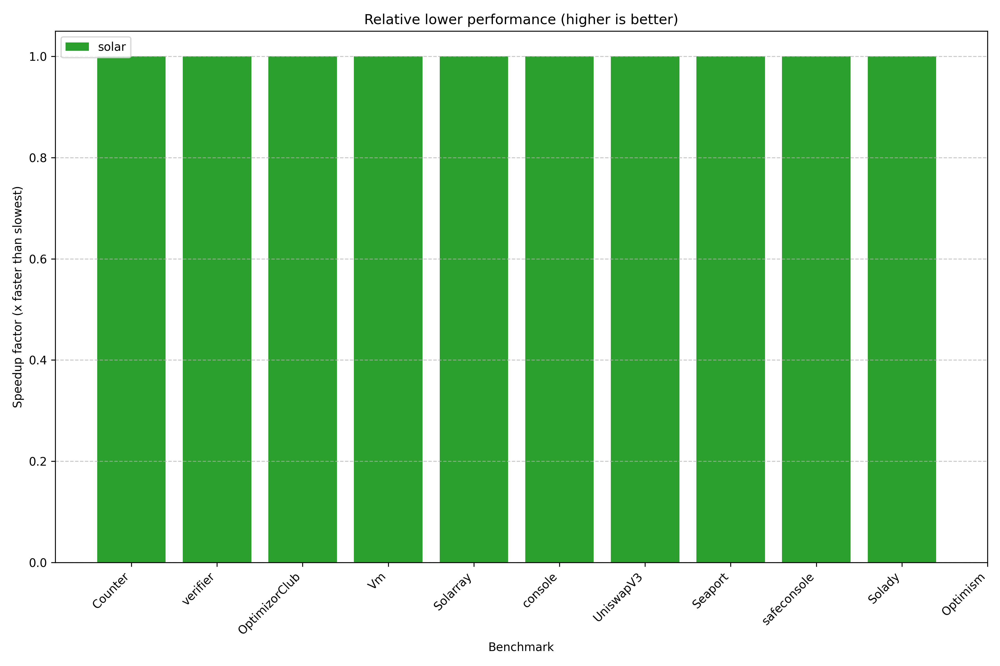

# solar-bench

Simple benchmarks across different Solidity parser implementations.

Requires cloning submodules: `git submodule update --init --checkout`.

Run with:

```bash
# Criterion
cargo bench -p solar-bench --bench criterion -- --quiet --format terse parser |& tee benches/criterion.out
uv --project benches/analyze run benches/analyze/main.py benches/README.md < benches/criterion.out

# iai - requires `valgrind` and `iai-callgrind-runner`
cargo bench -p solar-bench --bench iai
```

Currently this takes around 30 minutes to complete: `sources (12) * parsers (5) * lexers (2) * 15s`.

This crate is excluded from the main workspace to avoid compiling it (and its dependencies) when
invoking other commands such as `cargo test`.

## Results

You can view the Solar-only results on [codspeed.io](https://codspeed.io/paradigmxyz/solar).

The following results were achieved on:
- Target: `x86_64-unknown-linux-gnu`
- CPU: AMD Ryzen 9 5950X
- Versions:
  - [`solc 0.8.30`](https://github.com/argotorg/solidity)
  - [`solar 0.1.7`](../README.md)
  - [`solang-parser 0.3.4`](https://crates.io/crates/solang-parser)
  - [`slang 0.18.3`](https://crates.io/crates/slang)
  - [`tree-sitter 0.25.4`](https://crates.io/crates/tree-sitter), [`tree-sitter-solidity 1.2.11`](https://crates.io/crates/tree-sitter-solidity)

<!-- AUTOGENERATED MARKER -->




### empty (0 LoC, 0 bytes)

#### Lex
| Parser   | Relative   | Time      | LoC/s   | Bytes/s   |
|:---------|:-----------|:----------|:--------|:----------|
| solang   | 19.00x     | 12.518 ns | N/A     | N/A       |
| solar    | 1.00x      | 228.19 ns | N/A     | N/A       |

#### Parse
| Parser      | Relative   | Time      | LoC/s   | Bytes/s   |
|:------------|:-----------|:----------|:--------|:----------|
| solang      | 37.85x     | 104.82 ns | N/A     | N/A       |
| tree-sitter | 6.67x      | 590.58 ns | N/A     | N/A       |
| solar       | 4.28x      | 919.39 ns | N/A     | N/A       |
| solc        | 3.94x      | 1.0000 µs | N/A     | N/A       |
| slang       | 1.00x      | 3.9367 µs | N/A     | N/A       |

#### Lower
| Parser   | Relative   | Time      | LoC/s   | Bytes/s   |
|:---------|:-----------|:----------|:--------|:----------|
| solar    | 1.00x      | 5.1305 µs | N/A     | N/A       |

### Counter (14 LoC, 258 bytes)

#### Lex
| Parser   | Relative   | Time      | LoC/s   | Bytes/s   |
|:---------|:-----------|:----------|:--------|:----------|
| solang   | 2.38x      | 1.8468 µs | 7.58M   | 139.76M   |
| solar    | 1.00x      | 4.3858 µs | 3.19M   | 58.84M    |

#### Parse
| Parser      | Relative   | Time      | LoC/s   | Bytes/s   |
|:------------|:-----------|:----------|:--------|:----------|
| solar       | 29.56x     | 6.9216 µs | 2.02M   | 37.28M    |
| solang      | 20.25x     | 10.104 µs | 1.39M   | 25.53M    |
| tree-sitter | 12.62x     | 16.214 µs | 863.50K | 15.91M    |
| solc        | 6.18x      | 33.100 µs | 422.96K | 7.79M     |
| slang       | 1.00x      | 204.58 µs | 68.43K  | 1.26M     |

#### Lower
| Parser   | Relative   | Time      | LoC/s   | Bytes/s   |
|:---------|:-----------|:----------|:--------|:----------|
| solar    | 1.00x      | 13.074 µs | 1.07M   | 19.73M    |

### verifier (208 LoC, 11040 bytes)

#### Lex
| Parser   | Relative   | Time      | LoC/s   | Bytes/s   |
|:---------|:-----------|:----------|:--------|:----------|
| solar    | 1.61x      | 52.741 µs | 3.94M   | 209.32M   |
| solang   | 1.00x      | 85.158 µs | 2.44M   | 129.64M   |

#### Parse
| Parser      | Relative   | Time      | LoC/s   | Bytes/s   |
|:------------|:-----------|:----------|:--------|:----------|
| solar       | 103.49x    | 99.863 µs | 2.08M   | 110.55M   |
| solang      | 18.76x     | 550.90 µs | 377.56K | 20.04M    |
| solc        | 13.47x     | 767.10 µs | 271.15K | 14.39M    |
| tree-sitter | 10.50x     | 984.27 µs | 211.32K | 11.22M    |
| slang       | 1.00x      | 10.335 ms | 20.13K  | 1.07M     |

#### Lower
| Parser   | Relative   | Time      | LoC/s   | Bytes/s   |
|:---------|:-----------|:----------|:--------|:----------|
| solar    | 1.00x      | 138.65 µs | 1.50M   | 79.62M    |

### OptimizorClub (782 LoC, 35905 bytes)

#### Lex
| Parser   | Relative   | Time      | LoC/s   | Bytes/s   |
|:---------|:-----------|:----------|:--------|:----------|
| solar    | 1.88x      | 131.80 µs | 5.93M   | 272.42M   |
| solang   | 1.00x      | 248.07 µs | 3.15M   | 144.74M   |

#### Parse
| Parser      | Relative   | Time      | LoC/s   | Bytes/s   |
|:------------|:-----------|:----------|:--------|:----------|
| solar       | 101.78x    | 273.17 µs | 2.86M   | 131.44M   |
| solang      | 17.97x     | 1.5469 ms | 505.53K | 23.21M    |
| solc        | 14.62x     | 1.9012 ms | 411.32K | 18.89M    |
| tree-sitter | 10.02x     | 2.7737 ms | 281.93K | 12.94M    |
| slang       | 1.00x      | 27.804 ms | 28.13K  | 1.29M     |

#### Lower
| Parser   | Relative   | Time      | LoC/s   | Bytes/s   |
|:---------|:-----------|:----------|:--------|:----------|
| solar    | 1.00x      | 370.78 µs | 2.11M   | 96.84M    |

### UniswapV3 (3189 LoC, 146583 bytes)

#### Lex
| Parser   | Relative   | Time      | LoC/s   | Bytes/s   |
|:---------|:-----------|:----------|:--------|:----------|
| solar    | 2.32x      | 364.66 µs | 8.75M   | 401.97M   |
| solang   | 1.00x      | 844.45 µs | 3.78M   | 173.58M   |

#### Parse
| Parser      | Relative   | Time      | LoC/s   | Bytes/s   |
|:------------|:-----------|:----------|:--------|:----------|
| solar       | 109.37x    | 701.03 µs | 4.55M   | 209.10M   |
| solang      | 18.86x     | 4.0652 ms | 784.46K | 36.06M    |
| solc        | 14.72x     | 5.2086 ms | 612.26K | 28.14M    |
| tree-sitter | 10.02x     | 7.6495 ms | 416.89K | 19.16M    |
| slang       | 1.00x      | 76.671 ms | 41.59K  | 1.91M     |

#### Lower
| Parser   | Relative   | Time      | LoC/s   | Bytes/s   |
|:---------|:-----------|:----------|:--------|:----------|
| solar    | 1.00x      | 946.03 µs | 3.37M   | 154.95M   |

### Solarray (1544 LoC, 35898 bytes)

#### Lex
| Parser   | Relative   | Time      | LoC/s   | Bytes/s   |
|:---------|:-----------|:----------|:--------|:----------|
| solar    | 2.36x      | 153.91 µs | 10.03M  | 233.24M   |
| solang   | 1.00x      | 362.69 µs | 4.26M   | 98.98M    |

#### Parse
| Parser      | Relative   | Time      | LoC/s   | Bytes/s   |
|:------------|:-----------|:----------|:--------|:----------|
| solar       | 174.33x    | 402.44 µs | 3.84M   | 89.20M    |
| solc        | 26.49x     | 2.6485 ms | 582.97K | 13.55M    |
| solang      | 21.84x     | 3.2118 ms | 480.73K | 11.18M    |
| tree-sitter | 13.09x     | 5.3584 ms | 288.15K | 6.70M     |
| slang       | 1.00x      | 70.157 ms | 22.01K  | 511.68K   |

#### Lower
| Parser   | Relative   | Time      | LoC/s   | Bytes/s   |
|:---------|:-----------|:----------|:--------|:----------|
| solar    | 1.00x      | 563.84 µs | 2.74M   | 63.67M    |

### console (1552 LoC, 67315 bytes)

#### Lex
| Parser   | Relative   | Time      | LoC/s   | Bytes/s   |
|:---------|:-----------|:----------|:--------|:----------|
| solar    | 2.24x      | 241.57 µs | 6.42M   | 278.66M   |
| solang   | 1.00x      | 541.30 µs | 2.87M   | 124.36M   |

#### Parse
| Parser      | Relative   | Time      | LoC/s   | Bytes/s   |
|:------------|:-----------|:----------|:--------|:----------|
| solar       | 138.69x    | 540.66 µs | 2.87M   | 124.51M   |
| solc        | 19.88x     | 3.7710 ms | 411.56K | 17.85M    |
| solang      | 18.37x     | 4.0809 ms | 380.31K | 16.50M    |
| tree-sitter | 10.71x     | 7.0013 ms | 221.67K | 9.61M     |
| slang       | 1.00x      | 74.986 ms | 20.70K  | 897.70K   |

#### Lower
| Parser   | Relative   | Time      | LoC/s   | Bytes/s   |
|:---------|:-----------|:----------|:--------|:----------|
| solar    | 1.00x      | 828.06 µs | 1.87M   | 81.29M    |

### Vm (1763 LoC, 91405 bytes)

#### Lex
| Parser   | Relative   | Time      | LoC/s   | Bytes/s   |
|:---------|:-----------|:----------|:--------|:----------|
| solar    | 2.39x      | 205.27 µs | 8.59M   | 445.29M   |
| solang   | 1.00x      | 489.96 µs | 3.60M   | 186.56M   |

#### Parse
| Parser      | Relative   | Time      | LoC/s   | Bytes/s   |
|:------------|:-----------|:----------|:--------|:----------|
| solar       | 59.77x     | 354.85 µs | 4.97M   | 257.59M   |
| solang      | 13.76x     | 1.5416 ms | 1.14M   | 59.29M    |
| solc        | 7.95x      | 2.6674 ms | 660.94K | 34.27M    |
| tree-sitter | 6.72x      | 3.1581 ms | 558.25K | 28.94M    |
| slang       | 1.00x      | 21.211 ms | 83.12K  | 4.31M     |

#### Lower
| Parser   | Relative   | Time      | LoC/s   | Bytes/s   |
|:---------|:-----------|:----------|:--------|:----------|
| solar    | 1.00x      | 450.70 µs | 3.91M   | 202.81M   |

### safeconsole (13248 LoC, 397898 bytes)

#### Lex
| Parser   | Relative   | Time      | LoC/s   | Bytes/s   |
|:---------|:-----------|:----------|:--------|:----------|
| solar    | 2.64x      | 1.1424 ms | 11.60M  | 348.30M   |
| solang   | 1.00x      | 3.0210 ms | 4.39M   | 131.71M   |

#### Parse
| Parser      | Relative   | Time      | LoC/s   | Bytes/s   |
|:------------|:-----------|:----------|:--------|:----------|
| solar       | 146.90x    | 2.8326 ms | 4.68M   | 140.47M   |
| solang      | 25.34x     | 16.423 ms | 806.67K | 24.23M    |
| solc        | 17.22x     | 24.169 ms | 548.12K | 16.46M    |
| tree-sitter | 15.53x     | 26.794 ms | 494.44K | 14.85M    |
| slang       | 1.00x      | 416.12 ms | 31.84K  | 956.21K   |

#### Lower
| Parser   | Relative   | Time      | LoC/s   | Bytes/s   |
|:---------|:-----------|:----------|:--------|:----------|
| solar    | 1.00x      | 3.3226 ms | 3.99M   | 119.76M   |

### Seaport (19935 LoC, 770547 bytes)

#### Lex
| Parser   | Relative   | Time      | LoC/s   | Bytes/s   |
|:---------|:-----------|:----------|:--------|:----------|
| solar    | 2.97x      | 1.2364 ms | 16.12M  | 623.22M   |
| solang   | 1.00x      | 3.6747 ms | 5.42M   | 209.69M   |

#### Parse
| Parser      | Relative   | Time      | LoC/s   | Bytes/s   |
|:------------|:-----------|:----------|:--------|:----------|
| solar       | 113.12x    | 2.3058 ms | 8.65M   | 334.18M   |
| solang      | 22.50x     | 11.590 ms | 1.72M   | 66.48M    |
| solc        | 11.77x     | 22.155 ms | 899.76K | 34.78M    |
| tree-sitter | 11.53x     | 22.631 ms | 880.87K | 34.05M    |
| slang       | 1.00x      | 260.83 ms | 76.43K  | 2.95M     |

#### Lower
| Parser   | Relative   | Time      | LoC/s   | Bytes/s   |
|:---------|:-----------|:----------|:--------|:----------|
| solar    | 1.00x      | 2.7621 ms | 7.22M   | 278.97M   |

### Solady (31047 LoC, 1381235 bytes)

#### Lex
| Parser   | Relative   | Time      | LoC/s   | Bytes/s   |
|:---------|:-----------|:----------|:--------|:----------|
| solar    | 2.49x      | 3.3762 ms | 9.20M   | 409.11M   |
| solang   | 1.00x      | 8.3946 ms | 3.70M   | 164.54M   |

#### Parse
| Parser      | Relative   | Time      | LoC/s   | Bytes/s   |
|:------------|:-----------|:----------|:--------|:----------|
| solar       | 122.82x    | 6.8767 ms | 4.51M   | 200.86M   |
| solang      | 21.33x     | 39.588 ms | 784.25K | 34.89M    |
| solc        | 14.53x     | 58.107 ms | 534.30K | 23.77M    |
| tree-sitter | 13.57x     | 62.219 ms | 499.00K | 22.20M    |
| slang       | 1.00x      | 844.58 ms | 36.76K  | 1.64M     |

#### Lower
| Parser   | Relative   | Time      | LoC/s   | Bytes/s   |
|:---------|:-----------|:----------|:--------|:----------|
| solar    | 1.00x      | 8.0091 ms | 3.88M   | 172.46M   |

### Optimism (124413 LoC, 5383971 bytes)

#### Lex
| Parser   | Relative   | Time      | LoC/s   | Bytes/s   |
|:---------|:-----------|:----------|:--------|:----------|
| solar    | 2.50x      | 13.627 ms | 9.13M   | 395.10M   |
| solang   | 1.00x      | 34.092 ms | 3.65M   | 157.92M   |

#### Parse
| Parser      | Relative   | Time      | LoC/s   | Bytes/s   |
|:------------|:-----------|:----------|:--------|:----------|
| solar       | 240.01x    | 28.676 ms | 4.34M   | 187.75M   |
| solang      | 32.85x     | 209.52 ms | 593.80K | 25.70M    |
| solc        | 29.49x     | 233.36 ms | 533.14K | 23.07M    |
| tree-sitter | 16.43x     | 418.86 ms | 297.03K | 12.85M    |
| slang       | 1.00x      | 6.8825 s  | 18.08K  | 782.27K   |

#### Lower
| Parser   | Relative   | Time   | LoC/s   | Bytes/s   |
|----------|------------|--------|---------|-----------|
