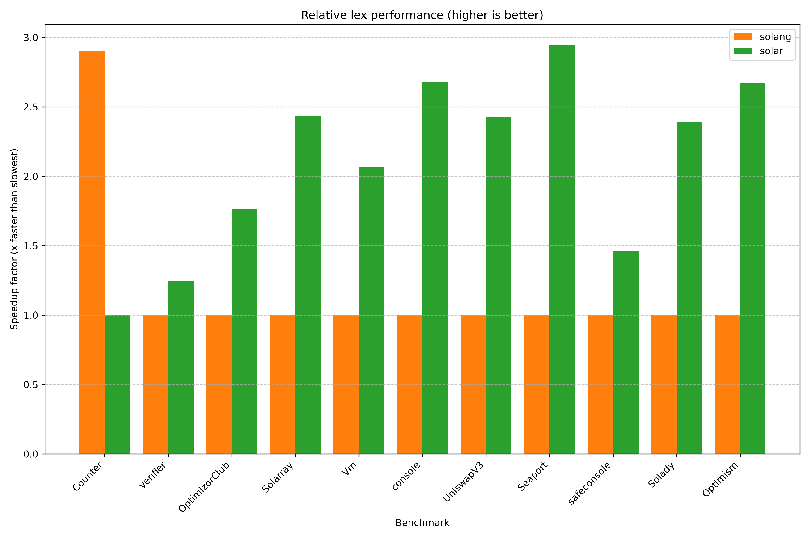

# solar-bench

Simple benchmarks across different Solidity parser implementations.

Requires cloning submodules: `git submodule update --init --checkout`.

Run with:

```bash
# Criterion
cargo bench -p solar-bench --bench criterion -- --quiet --format terse 'compiler/(empty|Counter|verifier|OptimizorClub|UniswapV3|Solarray|console|Vm|safeconsole|Seaport|Solady|Optimism)/.*/(lex|parse|lower)$' |& tee benches/criterion.out
uv --project benches/analyze run benches/analyze/main.py benches/README.md < benches/criterion.out
```

This takes around 24 minutes to complete: `sources (12) * benchmark cases (8) * 15s`.

This crate is excluded from the main workspace to avoid compiling it (and its dependencies) when
invoking other commands such as `cargo test`.

## Results

You can view the Solar-only results on [codspeed.io](https://codspeed.io/paradigmxyz/solar).
The codegen runtime workflow also publishes `common.json` using the vendored common benchmark
result schema in [`schema/`](schema/), with wall-time metrics for each suite's compiler and runtime
work.

The [benchmark workflow](../.github/workflows/bench.yml) runs automatically for pull requests and
updates to `main`. CodSpeed simulates the single-file and whole-project benchmarks, including
codegen for selected projects. The workflow can also be dispatched for codegen runtime comparisons,
CodSpeed, or both, and can override the pinned solc release.

The codegen runtime job compiles a vendored corpus with both compilers, deploys both artifacts to
Anvil, executes ordered stateful workloads, and requires normalized return values and cold-path
observations to match. The corpus contains four micro contracts, including the shared
`testdata/Counter.sol`, nine minimal import closures from real repositories, and three large
contracts extracted from the pinned OpenZeppelin and Solady project inputs. Its sources and
upstream commits are documented in the shared project archive
[`testdata/projects/`](../testdata/projects/) and in
[`benches/runtime/`](runtime/README.md).
A `heavy` suite additionally compiles nine vendored whole-project inputs end to end; they take
from seconds to minutes on solc, participate only in the compilation-time table, and skip size,
gas, and runtime comparisons.
The runtime harness and its tests are in [`runtime/`](runtime/).

Use `--suite heavy` to compare full-project compile times. This
suite passes each archived Foundry Standard JSON input unchanged to both compilers, so it includes
the project's test sources and build settings. It records compile time (and peak RSS) only; it does
not run Criterion, deployments, gas calls, or runtime checks. `--suite large` remains the focused
runtime workload.

For example, this command benchmarks the `my-branch` candidate with Gungraun, compares it against
`main`, and skips the codegen runtime and CodSpeed jobs:

```bash
gh workflow run bench.yml --ref my-branch \
  -f benchmark=gungraun \
  -f comparison_ref=main
```
The following results were achieved on:
- Target: `x86_64-unknown-linux-gnu`
- CPU: AMD Ryzen 9 7950X
- Versions:
  - [`solc 0.8.35`](https://github.com/argotorg/solidity)
  - [`solar 0.2.0`](../README.md)
  - [`solang-parser 0.3.4`](https://crates.io/crates/solang-parser)
  - [`slang 0.18.3`](https://crates.io/crates/slang)
  - [`tree-sitter 0.25.8`](https://crates.io/crates/tree-sitter), [`tree-sitter-solidity 1.2.12`](https://crates.io/crates/tree-sitter-solidity)

<!-- AUTOGENERATED MARKER -->




### empty (0 LoC, 0 bytes)

#### Lex
| Parser   | Relative   | Time      | LoC/s   | Bytes/s   |
|:---------|:-----------|:----------|:--------|:----------|
| solang   | 14.33x     | 12.712 ns | N/A     | N/A       |
| solar    | 1.00x      | 172.29 ns | N/A     | N/A       |

#### Parse
| Parser      | Relative   | Time      | LoC/s   | Bytes/s   |
|:------------|:-----------|:----------|:--------|:----------|
| solang      | 42.68x     | 79.767 ns | N/A     | N/A       |
| tree-sitter | 8.76x      | 385.36 ns | N/A     | N/A       |
| solc        | 3.37x      | 1.0000 µs | N/A     | N/A       |
| solar       | 1.51x      | 2.2394 µs | N/A     | N/A       |
| slang       | 1.00x      | 3.3720 µs | N/A     | N/A       |

#### Lower
| Parser   | Relative   | Time      | LoC/s   | Bytes/s   |
|:---------|:-----------|:----------|:--------|:----------|
| solar    | 1.00x      | 4.5753 µs | N/A     | N/A       |

### Counter (14 LoC, 258 bytes)

#### Lex
| Parser   | Relative   | Time      | LoC/s   | Bytes/s   |
|:---------|:-----------|:----------|:--------|:----------|
| solang   | 2.90x      | 1.4823 µs | 9.45M   | 174.09M   |
| solar    | 1.00x      | 4.3058 µs | 3.25M   | 59.93M    |

#### Parse
| Parser      | Relative   | Time      | LoC/s   | Bytes/s   |
|:------------|:-----------|:----------|:--------|:----------|
| solang      | 23.11x     | 7.7718 µs | 1.80M   | 33.20M    |
| solar       | 22.51x     | 7.9791 µs | 1.75M   | 32.33M    |
| tree-sitter | 16.07x     | 11.177 µs | 1.25M   | 23.08M    |
| solc        | 7.52x      | 23.900 µs | 585.77K | 10.79M    |
| slang       | 1.00x      | 179.62 µs | 77.94K  | 1.44M     |

#### Lower
| Parser   | Relative   | Time      | LoC/s   | Bytes/s   |
|:---------|:-----------|:----------|:--------|:----------|
| solar    | 1.00x      | 11.629 µs | 1.20M   | 22.19M    |

### verifier (208 LoC, 11040 bytes)

#### Lex
| Parser   | Relative   | Time      | LoC/s   | Bytes/s   |
|:---------|:-----------|:----------|:--------|:----------|
| solar    | 1.25x      | 48.674 µs | 4.27M   | 226.82M   |
| solang   | 1.00x      | 60.727 µs | 3.43M   | 181.80M   |

#### Parse
| Parser      | Relative   | Time      | LoC/s   | Bytes/s   |
|:------------|:-----------|:----------|:--------|:----------|
| solar       | 106.35x    | 87.455 µs | 2.38M   | 126.24M   |
| solang      | 23.56x     | 394.74 µs | 526.93K | 27.97M    |
| solc        | 14.72x     | 631.70 µs | 329.27K | 17.48M    |
| tree-sitter | 12.82x     | 725.56 µs | 286.68K | 15.22M    |
| slang       | 1.00x      | 9.3010 ms | 22.36K  | 1.19M     |

#### Lower
| Parser   | Relative   | Time      | LoC/s   | Bytes/s   |
|:---------|:-----------|:----------|:--------|:----------|
| solar    | 1.00x      | 116.58 µs | 1.78M   | 94.70M    |

### OptimizorClub (782 LoC, 35905 bytes)

#### Lex
| Parser   | Relative   | Time      | LoC/s   | Bytes/s   |
|:---------|:-----------|:----------|:--------|:----------|
| solar    | 1.77x      | 111.43 µs | 7.02M   | 322.22M   |
| solang   | 1.00x      | 196.96 µs | 3.97M   | 182.30M   |

#### Parse
| Parser      | Relative   | Time      | LoC/s   | Bytes/s   |
|:------------|:-----------|:----------|:--------|:----------|
| solar       | 118.06x    | 213.47 µs | 3.66M   | 168.20M   |
| solang      | 21.52x     | 1.1714 ms | 667.58K | 30.65M    |
| solc        | 17.58x     | 1.4338 ms | 545.40K | 25.04M    |
| tree-sitter | 12.22x     | 2.0624 ms | 379.17K | 17.41M    |
| slang       | 1.00x      | 25.203 ms | 31.03K  | 1.42M     |

#### Lower
| Parser   | Relative   | Time      | LoC/s   | Bytes/s   |
|:---------|:-----------|:----------|:--------|:----------|
| solar    | 1.00x      | 299.03 µs | 2.62M   | 120.07M   |

### UniswapV3 (3189 LoC, 146583 bytes)

#### Lex
| Parser   | Relative   | Time      | LoC/s   | Bytes/s   |
|:---------|:-----------|:----------|:--------|:----------|
| solar    | 2.43x      | 272.56 µs | 11.70M  | 537.80M   |
| solang   | 1.00x      | 661.67 µs | 4.82M   | 221.53M   |

#### Parse
| Parser      | Relative   | Time      | LoC/s   | Bytes/s   |
|:------------|:-----------|:----------|:--------|:----------|
| solar       | 116.64x    | 604.31 µs | 5.28M   | 242.56M   |
| solang      | 22.36x     | 3.1516 ms | 1.01M   | 46.51M    |
| solc        | 16.70x     | 4.2217 ms | 755.38K | 34.72M    |
| tree-sitter | 12.05x     | 5.8477 ms | 545.34K | 25.07M    |
| slang       | 1.00x      | 70.484 ms | 45.24K  | 2.08M     |

#### Lower
| Parser   | Relative   | Time      | LoC/s   | Bytes/s   |
|:---------|:-----------|:----------|:--------|:----------|
| solar    | 1.00x      | 834.90 µs | 3.82M   | 175.57M   |

### Solarray (1544 LoC, 35898 bytes)

#### Lex
| Parser   | Relative   | Time      | LoC/s   | Bytes/s   |
|:---------|:-----------|:----------|:--------|:----------|
| solar    | 2.43x      | 122.60 µs | 12.59M  | 292.81M   |
| solang   | 1.00x      | 298.16 µs | 5.18M   | 120.40M   |

#### Parse
| Parser      | Relative   | Time      | LoC/s   | Bytes/s   |
|:------------|:-----------|:----------|:--------|:----------|
| solar       | 177.13x    | 359.61 µs | 4.29M   | 99.82M    |
| solc        | 26.57x     | 2.3976 ms | 643.98K | 14.97M    |
| solang      | 24.63x     | 2.5860 ms | 597.06K | 13.88M    |
| tree-sitter | 15.49x     | 4.1115 ms | 375.53K | 8.73M     |
| slang       | 1.00x      | 63.697 ms | 24.24K  | 563.57K   |

#### Lower
| Parser   | Relative   | Time      | LoC/s   | Bytes/s   |
|:---------|:-----------|:----------|:--------|:----------|
| solar    | 1.00x      | 506.47 µs | 3.05M   | 70.88M    |

### console (1552 LoC, 67315 bytes)

#### Lex
| Parser   | Relative   | Time      | LoC/s   | Bytes/s   |
|:---------|:-----------|:----------|:--------|:----------|
| solar    | 2.68x      | 218.35 µs | 7.11M   | 308.29M   |
| solang   | 1.00x      | 584.42 µs | 2.66M   | 115.18M   |

#### Parse
| Parser      | Relative   | Time      | LoC/s   | Bytes/s   |
|:------------|:-----------|:----------|:--------|:----------|
| solar       | 167.91x    | 474.82 µs | 3.27M   | 141.77M   |
| solc        | 22.36x     | 3.5654 ms | 435.29K | 18.88M    |
| tree-sitter | 15.12x     | 5.2723 ms | 294.37K | 12.77M    |
| solang      | 13.75x     | 5.7985 ms | 267.66K | 11.61M    |
| slang       | 1.00x      | 79.728 ms | 19.47K  | 844.31K   |

#### Lower
| Parser   | Relative   | Time      | LoC/s   | Bytes/s   |
|:---------|:-----------|:----------|:--------|:----------|
| solar    | 1.00x      | 747.87 µs | 2.08M   | 90.01M    |

### Vm (1763 LoC, 91405 bytes)

#### Lex
| Parser   | Relative   | Time      | LoC/s   | Bytes/s   |
|:---------|:-----------|:----------|:--------|:----------|
| solar    | 2.07x      | 190.93 µs | 9.23M   | 478.74M   |
| solang   | 1.00x      | 394.84 µs | 4.47M   | 231.50M   |

#### Parse
| Parser      | Relative   | Time      | LoC/s   | Bytes/s   |
|:------------|:-----------|:----------|:--------|:----------|
| solar       | 59.29x     | 330.04 µs | 5.34M   | 276.95M   |
| solang      | 14.50x     | 1.3494 ms | 1.31M   | 67.74M    |
| solc        | 8.14x      | 2.4036 ms | 733.48K | 38.03M    |
| tree-sitter | 7.86x      | 2.4902 ms | 707.98K | 36.71M    |
| slang       | 1.00x      | 19.569 ms | 90.09K  | 4.67M     |

#### Lower
| Parser   | Relative   | Time      | LoC/s   | Bytes/s   |
|:---------|:-----------|:----------|:--------|:----------|
| solar    | 1.00x      | 434.03 µs | 4.06M   | 210.60M   |

### safeconsole (13248 LoC, 397898 bytes)

#### Lex
| Parser   | Relative   | Time      | LoC/s   | Bytes/s   |
|:---------|:-----------|:----------|:--------|:----------|
| solar    | 1.46x      | 1.6499 ms | 8.03M   | 241.16M   |
| solang   | 1.00x      | 2.4171 ms | 5.48M   | 164.62M   |

#### Parse
| Parser      | Relative   | Time      | LoC/s   | Bytes/s   |
|:------------|:-----------|:----------|:--------|:----------|
| solar       | 152.98x    | 2.6091 ms | 5.08M   | 152.50M   |
| solang      | 23.60x     | 16.910 ms | 783.44K | 23.53M    |
| tree-sitter | 17.81x     | 22.416 ms | 591.01K | 17.75M    |
| solc        | 15.16x     | 26.329 ms | 503.17K | 15.11M    |
| slang       | 1.00x      | 399.14 ms | 33.19K  | 996.89K   |

#### Lower
| Parser   | Relative   | Time      | LoC/s   | Bytes/s   |
|:---------|:-----------|:----------|:--------|:----------|
| solar    | 1.00x      | 3.9529 ms | 3.35M   | 100.66M   |

### Seaport (19935 LoC, 770548 bytes)

#### Lex
| Parser   | Relative   | Time      | LoC/s   | Bytes/s   |
|:---------|:-----------|:----------|:--------|:----------|
| solar    | 2.95x      | 1.0143 ms | 19.65M  | 759.68M   |
| solang   | 1.00x      | 2.9882 ms | 6.67M   | 257.86M   |

#### Parse
| Parser      | Relative   | Time      | LoC/s   | Bytes/s   |
|:------------|:-----------|:----------|:--------|:----------|
| solar       | 115.85x    | 2.0293 ms | 9.82M   | 379.71M   |
| solang      | 23.22x     | 10.124 ms | 1.97M   | 76.11M    |
| tree-sitter | 13.68x     | 17.184 ms | 1.16M   | 44.84M    |
| solc        | 11.94x     | 19.694 ms | 1.01M   | 39.13M    |
| slang       | 1.00x      | 235.09 ms | 84.80K  | 3.28M     |

#### Lower
| Parser   | Relative   | Time      | LoC/s   | Bytes/s   |
|:---------|:-----------|:----------|:--------|:----------|
| solar    | 1.00x      | 2.8922 ms | 6.89M   | 266.42M   |

### Solady (31047 LoC, 1381235 bytes)

#### Lex
| Parser   | Relative   | Time      | LoC/s   | Bytes/s   |
|:---------|:-----------|:----------|:--------|:----------|
| solar    | 2.39x      | 3.1982 ms | 9.71M   | 431.88M   |
| solang   | 1.00x      | 7.6389 ms | 4.06M   | 180.82M   |

#### Parse
| Parser      | Relative   | Time      | LoC/s   | Bytes/s   |
|:------------|:-----------|:----------|:--------|:----------|
| solar       | 122.71x    | 6.0668 ms | 5.12M   | 227.67M   |
| solang      | 20.69x     | 35.985 ms | 862.78K | 38.38M    |
| solc        | 15.53x     | 47.939 ms | 647.64K | 28.81M    |
| tree-sitter | 14.20x     | 52.433 ms | 592.13K | 26.34M    |
| slang       | 1.00x      | 744.44 ms | 41.71K  | 1.86M     |

#### Lower
| Parser   | Relative   | Time      | LoC/s   | Bytes/s   |
|:---------|:-----------|:----------|:--------|:----------|
| solar    | 1.00x      | 11.751 ms | 2.64M   | 117.54M   |

### Optimism (124413 LoC, 5383971 bytes)

#### Lex
| Parser   | Relative   | Time      | LoC/s   | Bytes/s   |
|:---------|:-----------|:----------|:--------|:----------|
| solar    | 2.67x      | 10.565 ms | 11.78M  | 509.60M   |
| solang   | 1.00x      | 28.242 ms | 4.41M   | 190.64M   |

#### Parse
| Parser      | Relative   | Time      | LoC/s   | Bytes/s   |
|:------------|:-----------|:----------|:--------|:----------|
| solar       | 233.80x    | 25.027 ms | 4.97M   | 215.13M   |
| solang      | 33.42x     | 175.06 ms | 710.69K | 30.76M    |
| solc        | 29.49x     | 198.40 ms | 627.06K | 27.14M    |
| tree-sitter | 16.38x     | 357.24 ms | 348.26K | 15.07M    |
| slang       | 1.00x      | 5.8512 s  | 21.26K  | 920.15K   |
