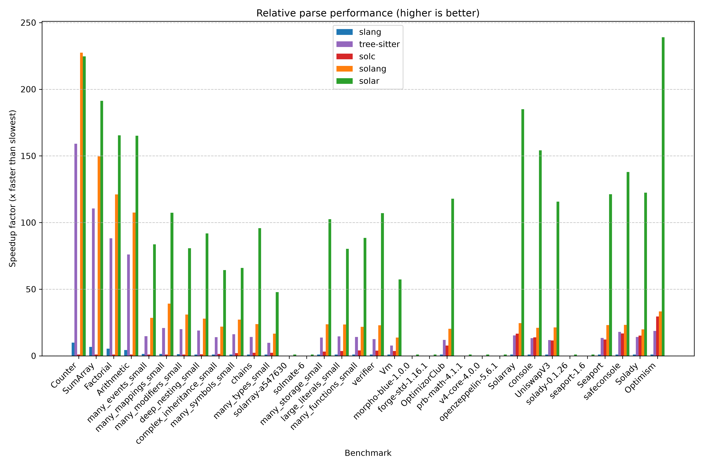

# solar-bench

Simple benchmarks across different Solidity parser implementations.

Requires cloning submodules: `git submodule update --init --checkout`.

Run with:

```bash
# Criterion
cargo bench -p solar-bench --bench criterion -- --quiet --format terse 'parse$' |& tee benches/criterion.out
uv --project benches/analyze run benches/analyze/main.py benches/README.md < benches/criterion.out
```

This takes around 40 minutes to complete: `sources (36) * parsers (up to 5) * 15s`.

This crate is excluded from the main workspace to avoid compiling it (and its dependencies) when
invoking other commands such as `cargo test`.

## Results

You can view the Solar-only results on [codspeed.io](https://codspeed.io/paradigmxyz/solar).
The codegen runtime workflow also publishes `common.json` using the vendored common benchmark
result schema in [`schema/`](schema/), with wall-time metrics for each suite's compiler and runtime
work.

The [benchmark workflow](../.github/workflows/bench.yml) runs automatically for pull requests and
updates to `main`. CodSpeed simulates the single-file and whole-project benchmarks, including
codegen for selected projects. The workflow can also be dispatched for codegen runtime comparisons,
CodSpeed, or both, and can override the pinned solc release.

The codegen runtime job compiles a vendored corpus with both compilers, deploys both artifacts to
Anvil, executes ordered stateful workloads, and requires normalized return values and cold-path
observations to match. The corpus contains four micro contracts, including the shared
`testdata/Counter.sol`, nine minimal import closures from real repositories, and three large
contracts extracted from the pinned OpenZeppelin and Solady project inputs. Its sources and
upstream commits are documented in
[`testdata/codegen-runtime/`](../testdata/codegen-runtime/README.md).
A `heavy` suite additionally compiles three vendored whole-project inputs (Seaport 1.6,
Uniswap v4-core, and Morpho Blue) end to end; they take tens of seconds on solc, participate
only in the compilation-time table, and skip size, gas, and runtime comparisons.
The runtime harness and its tests are in [`runtime/`](runtime/).

The following results were achieved on:
- Target: `x86_64-unknown-linux-gnu`
- CPU: AMD Ryzen 9 7950X
- Versions:
  - [`solc 0.8.35`](https://github.com/argotorg/solidity)
  - [`solar 0.2.0`](../README.md)
  - [`solang-parser 0.3.4`](https://crates.io/crates/solang-parser)
  - [`slang 0.18.3`](https://crates.io/crates/slang)
  - [`tree-sitter 0.25.8`](https://crates.io/crates/tree-sitter), [`tree-sitter-solidity 1.2.12`](https://crates.io/crates/tree-sitter-solidity)

<!-- AUTOGENERATED MARKER -->



### empty (0 LoC, 0 bytes)

#### Parse
| Parser      | Relative   | Time      | LoC/s   | Bytes/s   |
|:------------|:-----------|:----------|:--------|:----------|
| solang      | 23.14Kx    | 87.448 ns | N/A     | N/A       |
| tree-sitter | 5.41Kx     | 372.07 ns | N/A     | N/A       |
| solar       | 875.82x    | 2.2993 µs | N/A     | N/A       |
| slang       | 588.91x    | 3.4193 µs | N/A     | N/A       |
| solc        | 1.00x      | 2.0135 ms | N/A     | N/A       |

### Counter (14 LoC, 258 bytes)

#### Parse
| Parser      | Relative   | Time      | LoC/s   | Bytes/s   |
|:------------|:-----------|:----------|:--------|:----------|
| solang      | 227.50x    | 8.0079 µs | 1.75M   | 32.22M    |
| solar       | 224.67x    | 8.1086 µs | 1.73M   | 31.82M    |
| tree-sitter | 159.12x    | 11.448 µs | 1.22M   | 22.54M    |
| slang       | 9.84x      | 185.05 µs | 75.66K  | 1.39M     |
| solc        | 1.00x      | 1.8216 ms | 7.69K   | 141.63K   |

### verifier (208 LoC, 11040 bytes)

#### Parse
| Parser      | Relative   | Time      | LoC/s   | Bytes/s   |
|:------------|:-----------|:----------|:--------|:----------|
| solar       | 107.08x    | 87.501 µs | 2.38M   | 126.17M   |
| solang      | 23.00x     | 407.36 µs | 510.60K | 27.10M    |
| tree-sitter | 12.55x     | 746.40 µs | 278.67K | 14.79M    |
| solc        | 3.85x      | 2.4327 ms | 85.50K  | 4.54M     |
| slang       | 1.00x      | 9.3697 ms | 22.20K  | 1.18M     |

### OptimizorClub (782 LoC, 35905 bytes)

#### Parse
| Parser      | Relative   | Time      | LoC/s   | Bytes/s   |
|:------------|:-----------|:----------|:--------|:----------|
| solar       | 117.80x    | 213.36 µs | 3.67M   | 168.28M   |
| solang      | 20.30x     | 1.2382 ms | 631.56K | 29.00M    |
| tree-sitter | 12.02x     | 2.0902 ms | 374.13K | 17.18M    |
| solc        | 7.76x      | 3.2372 ms | 241.57K | 11.09M    |
| slang       | 1.00x      | 25.133 ms | 31.11K  | 1.43M     |

### chains (91 LoC, 4761 bytes)

#### Parse
| Parser      | Relative   | Time      | LoC/s   | Bytes/s   |
|:------------|:-----------|:----------|:--------|:----------|
| solar       | 95.72x     | 48.732 µs | 1.87M   | 97.70M    |
| solang      | 23.85x     | 195.61 µs | 465.21K | 24.34M    |
| tree-sitter | 14.19x     | 328.79 µs | 276.77K | 14.48M    |
| solc        | 2.36x      | 1.9777 ms | 46.01K  | 2.41M     |
| slang       | 1.00x      | 4.6648 ms | 19.51K  | 1.02M     |

### UniswapV3 (3189 LoC, 146583 bytes)

#### Parse
| Parser      | Relative   | Time      | LoC/s   | Bytes/s   |
|:------------|:-----------|:----------|:--------|:----------|
| solar       | 115.62x    | 588.87 µs | 5.42M   | 248.92M   |
| solang      | 21.25x     | 3.2037 ms | 995.41K | 45.75M    |
| tree-sitter | 11.84x     | 5.7489 ms | 554.71K | 25.50M    |
| solc        | 11.54x     | 5.9020 ms | 540.33K | 24.84M    |
| slang       | 1.00x      | 68.084 ms | 46.84K  | 2.15M     |

### Solarray (1544 LoC, 35898 bytes)

#### Parse
| Parser      | Relative   | Time      | LoC/s   | Bytes/s   |
|:------------|:-----------|:----------|:--------|:----------|
| solar       | 185.08x    | 346.04 µs | 4.46M   | 103.74M   |
| solang      | 24.51x     | 2.6128 ms | 590.94K | 13.74M    |
| solc        | 16.65x     | 3.8468 ms | 401.37K | 9.33M     |
| tree-sitter | 15.37x     | 4.1660 ms | 370.62K | 8.62M     |
| slang       | 1.00x      | 64.046 ms | 24.11K  | 560.50K   |

### console (1552 LoC, 67315 bytes)

#### Parse
| Parser      | Relative   | Time      | LoC/s   | Bytes/s   |
|:------------|:-----------|:----------|:--------|:----------|
| solar       | 154.10x    | 450.12 µs | 3.45M   | 149.55M   |
| solang      | 20.98x     | 3.3054 ms | 469.53K | 20.37M    |
| solc        | 13.90x     | 4.9899 ms | 311.03K | 13.49M    |
| tree-sitter | 13.23x     | 5.2416 ms | 296.09K | 12.84M    |
| slang       | 1.00x      | 69.362 ms | 22.38K  | 970.49K   |

### Vm (1763 LoC, 91405 bytes)

#### Parse
| Parser      | Relative   | Time      | LoC/s   | Bytes/s   |
|:------------|:-----------|:----------|:--------|:----------|
| solar       | 57.32x     | 334.20 µs | 5.28M   | 273.50M   |
| solang      | 13.75x     | 1.3934 ms | 1.27M   | 65.60M    |
| tree-sitter | 7.67x      | 2.4983 ms | 705.68K | 36.59M    |
| solc        | 3.61x      | 5.3037 ms | 332.41K | 17.23M    |
| slang       | 1.00x      | 19.155 ms | 92.04K  | 4.77M     |

### safeconsole (13248 LoC, 397898 bytes)

#### Parse
| Parser      | Relative   | Time      | LoC/s   | Bytes/s   |
|:------------|:-----------|:----------|:--------|:----------|
| solar       | 137.88x    | 2.7041 ms | 4.90M   | 147.15M   |
| solang      | 23.19x     | 16.076 ms | 824.09K | 24.75M    |
| tree-sitter | 18.02x     | 20.696 ms | 640.12K | 19.23M    |
| solc        | 16.86x     | 22.118 ms | 598.97K | 17.99M    |
| slang       | 1.00x      | 372.85 ms | 35.53K  | 1.07M     |

### Seaport (19935 LoC, 770548 bytes)

#### Parse
| Parser      | Relative   | Time      | LoC/s   | Bytes/s   |
|:------------|:-----------|:----------|:--------|:----------|
| solar       | 121.20x    | 1.9987 ms | 9.97M   | 385.52M   |
| solang      | 23.04x     | 10.512 ms | 1.90M   | 73.30M    |
| tree-sitter | 13.45x     | 18.009 ms | 1.11M   | 42.79M    |
| solc        | 12.19x     | 19.868 ms | 1.00M   | 38.78M    |
| slang       | 1.00x      | 242.24 ms | 82.29K  | 3.18M     |

### Solady (31047 LoC, 1381235 bytes)

#### Parse
| Parser      | Relative   | Time      | LoC/s   | Bytes/s   |
|:------------|:-----------|:----------|:--------|:----------|
| solar       | 122.45x    | 6.1160 ms | 5.08M   | 225.84M   |
| solang      | 19.81x     | 37.802 ms | 821.31K | 36.54M    |
| solc        | 15.15x     | 49.438 ms | 628.00K | 27.94M    |
| tree-sitter | 14.18x     | 52.803 ms | 587.98K | 26.16M    |
| slang       | 1.00x      | 748.91 ms | 41.46K  | 1.84M     |

### Optimism (124413 LoC, 5383971 bytes)

#### Parse
| Parser      | Relative   | Time      | LoC/s   | Bytes/s   |
|:------------|:-----------|:----------|:--------|:----------|
| solar       | 239.04x    | 24.772 ms | 5.02M   | 217.34M   |
| solang      | 33.36x     | 177.51 ms | 700.88K | 30.33M    |
| solc        | 29.58x     | 200.18 ms | 621.51K | 26.90M    |
| tree-sitter | 18.74x     | 316.01 ms | 393.70K | 17.04M    |
| slang       | 1.00x      | 5.9214 s  | 21.01K  | 909.24K   |

### Arithmetic (15 LoC, 351 bytes)

#### Parse
| Parser      | Relative   | Time      | LoC/s   | Bytes/s   |
|:------------|:-----------|:----------|:--------|:----------|
| solar       | 165.12x    | 10.959 µs | 1.37M   | 32.03M    |
| solang      | 107.53x    | 16.829 µs | 891.32K | 20.86M    |
| tree-sitter | 75.98x     | 23.816 µs | 629.83K | 14.74M    |
| slang       | 4.38x      | 413.17 µs | 36.30K  | 849.53K   |
| solc        | 1.00x      | 1.8096 ms | 8.29K   | 193.97K   |

### Factorial (18 LoC, 361 bytes)

#### Parse
| Parser      | Relative   | Time      | LoC/s   | Bytes/s   |
|:------------|:-----------|:----------|:--------|:----------|
| solar       | 165.36x    | 10.926 µs | 1.65M   | 33.04M    |
| solang      | 121.12x    | 14.917 µs | 1.21M   | 24.20M    |
| tree-sitter | 88.17x     | 20.491 µs | 878.43K | 17.62M    |
| slang       | 5.44x      | 332.26 µs | 54.17K  | 1.09M     |
| solc        | 1.00x      | 1.8067 ms | 9.96K   | 199.81K   |

### SumArray (14 LoC, 278 bytes)

#### Parse
| Parser      | Relative   | Time      | LoC/s   | Bytes/s   |
|:------------|:-----------|:----------|:--------|:----------|
| solar       | 191.25x    | 9.6417 µs | 1.45M   | 28.84M    |
| solang      | 149.63x    | 12.322 µs | 1.14M   | 22.56M    |
| tree-sitter | 110.51x    | 16.684 µs | 839.13K | 16.66M    |
| slang       | 6.76x      | 272.88 µs | 51.30K  | 1.02M     |
| solc        | 1.00x      | 1.8438 ms | 7.59K   | 150.78K   |

### many_symbols_small (107 LoC, 1786 bytes)

#### Parse
| Parser      | Relative   | Time      | LoC/s   | Bytes/s   |
|:------------|:-----------|:----------|:--------|:----------|
| solar       | 65.88x     | 60.697 µs | 1.76M   | 29.42M    |
| solang      | 27.20x     | 146.99 µs | 727.94K | 12.15M    |
| tree-sitter | 16.26x     | 245.91 µs | 435.12K | 7.26M     |
| solc        | 2.03x      | 1.9668 ms | 54.40K  | 908.07K   |
| slang       | 1.00x      | 3.9986 ms | 26.76K  | 446.66K   |

### many_functions_small (104 LoC, 5750 bytes)

#### Parse
| Parser      | Relative   | Time      | LoC/s   | Bytes/s   |
|:------------|:-----------|:----------|:--------|:----------|
| solar       | 88.41x     | 101.83 µs | 1.02M   | 56.47M    |
| solang      | 21.83x     | 412.40 µs | 252.18K | 13.94M    |
| tree-sitter | 14.18x     | 634.71 µs | 163.85K | 9.06M     |
| solc        | 4.09x      | 2.2024 ms | 47.22K  | 2.61M     |
| slang       | 1.00x      | 9.0023 ms | 11.55K  | 638.73K   |

### deep_nesting_small (31 LoC, 610 bytes)

#### Parse
| Parser      | Relative   | Time      | LoC/s   | Bytes/s   |
|:------------|:-----------|:----------|:--------|:----------|
| solar       | 91.79x     | 23.327 µs | 1.33M   | 26.15M    |
| solang      | 27.84x     | 76.921 µs | 403.01K | 7.93M     |
| tree-sitter | 18.92x     | 113.17 µs | 273.92K | 5.39M     |
| solc        | 1.12x      | 1.9194 ms | 16.15K  | 317.81K   |
| slang       | 1.00x      | 2.1413 ms | 14.48K  | 284.87K   |

### many_types_small (304 LoC, 6340 bytes)

#### Parse
| Parser      | Relative   | Time      | LoC/s   | Bytes/s   |
|:------------|:-----------|:----------|:--------|:----------|
| solar       | 47.80x     | 110.09 µs | 2.76M   | 57.59M    |
| solang      | 16.71x     | 314.99 µs | 965.11K | 20.13M    |
| tree-sitter | 9.80x      | 536.87 µs | 566.25K | 11.81M    |
| solc        | 2.34x      | 2.2453 ms | 135.39K | 2.82M     |
| slang       | 1.00x      | 5.2626 ms | 57.77K  | 1.20M     |

### large_literals_small (207 LoC, 8771 bytes)

#### Parse
| Parser      | Relative   | Time      | LoC/s   | Bytes/s   |
|:------------|:-----------|:----------|:--------|:----------|
| solar       | 80.28x     | 94.673 µs | 2.19M   | 92.65M    |
| solang      | 23.53x     | 322.95 µs | 640.97K | 27.16M    |
| tree-sitter | 14.54x     | 522.67 µs | 396.04K | 16.78M    |
| solc        | 3.57x      | 2.1290 ms | 97.23K  | 4.12M     |
| slang       | 1.00x      | 7.6005 ms | 27.24K  | 1.15M     |

### many_storage_small (206 LoC, 3273 bytes)

#### Parse
| Parser      | Relative   | Time      | LoC/s   | Bytes/s   |
|:------------|:-----------|:----------|:--------|:----------|
| solar       | 102.52x    | 64.228 µs | 3.21M   | 50.96M    |
| solang      | 23.72x     | 277.55 µs | 742.21K | 11.79M    |
| tree-sitter | 13.70x     | 480.77 µs | 428.48K | 6.81M     |
| solc        | 3.13x      | 2.1005 ms | 98.07K  | 1.56M     |
| slang       | 1.00x      | 6.5847 ms | 31.28K  | 497.06K   |

### many_events_small (26 LoC, 1032 bytes)

#### Parse
| Parser      | Relative   | Time      | LoC/s   | Bytes/s   |
|:------------|:-----------|:----------|:--------|:----------|
| solar       | 83.70x     | 22.678 µs | 1.15M   | 45.51M    |
| solang      | 28.53x     | 66.535 µs | 390.77K | 15.51M    |
| tree-sitter | 14.70x     | 129.12 µs | 201.36K | 7.99M     |
| slang       | 1.47x      | 1.2948 ms | 20.08K  | 797.03K   |
| solc        | 1.00x      | 1.8981 ms | 13.70K  | 543.70K   |

### complex_inheritance_small (101 LoC, 2074 bytes)

#### Parse
| Parser      | Relative   | Time      | LoC/s   | Bytes/s   |
|:------------|:-----------|:----------|:--------|:----------|
| solar       | 64.39x     | 45.585 µs | 2.22M   | 45.50M    |
| solang      | 21.86x     | 134.26 µs | 752.27K | 15.45M    |
| tree-sitter | 14.01x     | 209.58 µs | 481.92K | 9.90M     |
| solc        | 1.49x      | 1.9686 ms | 51.31K  | 1.05M     |
| slang       | 1.00x      | 2.9353 ms | 34.41K  | 706.57K   |

### many_mappings_small (26 LoC, 686 bytes)

#### Parse
| Parser      | Relative   | Time      | LoC/s   | Bytes/s   |
|:------------|:-----------|:----------|:--------|:----------|
| solar       | 107.29x    | 17.896 µs | 1.45M   | 38.33M    |
| solang      | 39.10x     | 49.113 µs | 529.39K | 13.97M    |
| tree-sitter | 20.88x     | 91.977 µs | 282.68K | 7.46M     |
| slang       | 1.41x      | 1.3661 ms | 19.03K  | 502.16K   |
| solc        | 1.00x      | 1.9201 ms | 13.54K  | 357.27K   |

### many_modifiers_small (17 LoC, 635 bytes)

#### Parse
| Parser      | Relative   | Time      | LoC/s   | Bytes/s   |
|:------------|:-----------|:----------|:--------|:----------|
| solar       | 80.66x     | 23.222 µs | 732.06K | 27.34M    |
| solang      | 30.92x     | 60.577 µs | 280.63K | 10.48M    |
| tree-sitter | 19.94x     | 93.930 µs | 180.99K | 6.76M     |
| slang       | 1.27x      | 1.4719 ms | 11.55K  | 431.42K   |
| solc        | 1.00x      | 1.8730 ms | 9.08K   | 339.03K   |
