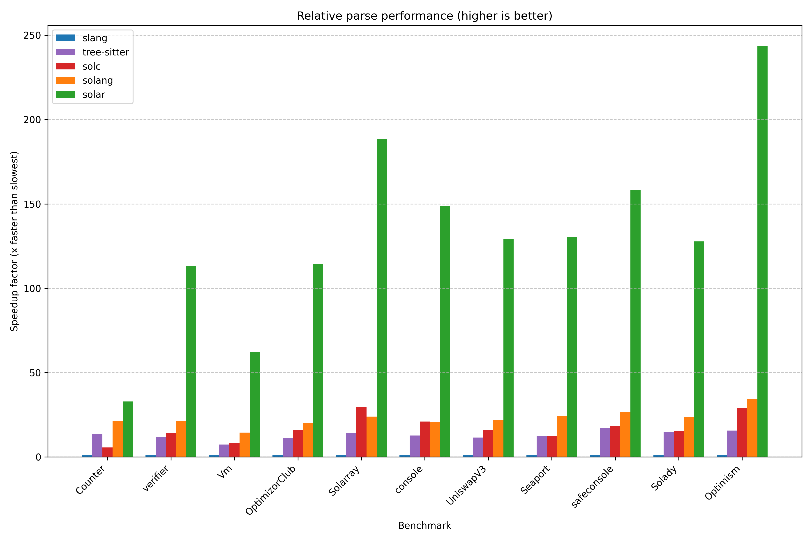

# solar-bench

Simple benchmarks across different Solidity parser implementations.

Requires cloning submodules: `git submodule update --init --checkout`.

Run with:

```bash
# Criterion
cargo bench -p solar-bench --bench criterion -- --quiet --format terse parser |& tee benches/criterion.out
uv --project benches/analyze run benches/analyze/main.py benches/README.md < benches/criterion.out

# iai - requires `valgrind` and `iai-callgrind-runner`
cargo bench -p solar-bench --bench iai
```

Currently this takes around 30 minutes to complete: `sources (12) * parsers (5) * lexers (2) * 15s`.

This crate is excluded from the main workspace to avoid compiling it (and its dependencies) when
invoking other commands such as `cargo test`.

## Results

You can view the Solar-only results on [codspeed.io](https://codspeed.io/paradigmxyz/solar).

The following results were achieved on:
- Target: `x86_64-unknown-linux-gnu`
- CPU: AMD Ryzen 9 5950X
- Versions:
  - [`solc 0.8.30`](https://github.com/argotorg/solidity)
  - [`solar 0.1.7`](../README.md)
  - [`solang-parser 0.3.4`](https://crates.io/crates/solang-parser)
  - [`slang 0.18.3`](https://crates.io/crates/slang)
  - [`tree-sitter 0.25.4`](https://crates.io/crates/tree-sitter), [`tree-sitter-solidity 1.2.11`](https://crates.io/crates/tree-sitter-solidity)

<!-- AUTOGENERATED MARKER -->




### empty (0 LoC, 0 bytes)

#### Lex
| Parser   | Relative   | Time      | LoC/s   | Bytes/s   |
|:---------|:-----------|:----------|:--------|:----------|
| solang   | 1.10x      | 10.832 ns | N/A     | N/A       |
| solar    | 1.00x      | 11.563 ns | N/A     | N/A       |

#### Parse
| Parser      | Relative   | Time      | LoC/s   | Bytes/s   |
|:------------|:-----------|:----------|:--------|:----------|
| solang      | 35.50x     | 105.08 ns | N/A     | N/A       |
| solar       | 30.06x     | 124.58 ns | N/A     | N/A       |
| tree-sitter | 6.58x      | 566.25 ns | N/A     | N/A       |
| solc        | 3.73x      | 1.0000 µs | N/A     | N/A       |
| slang       | 1.00x      | 3.7276 µs | N/A     | N/A       |

### Counter (14 LoC, 258 bytes)

#### Lex
| Parser   | Relative   | Time      | LoC/s   | Bytes/s   |
|:---------|:-----------|:----------|:--------|:----------|
| solar    | 2.75x      | 668.02 ns | 20.96M  | 386.23M   |
| solang   | 1.00x      | 1.8405 µs | 7.61M   | 140.22M   |

#### Parse
| Parser      | Relative   | Time      | LoC/s   | Bytes/s   |
|:------------|:-----------|:----------|:--------|:----------|
| solar       | 90.38x     | 2.0966 µs | 6.68M   | 123.09M   |
| solang      | 19.86x     | 9.5382 µs | 1.47M   | 27.05M    |
| tree-sitter | 12.00x     | 15.781 µs | 887.14K | 16.35M    |
| solc        | 5.12x      | 37.000 µs | 378.38K | 6.97M     |
| slang       | 1.00x      | 189.43 µs | 73.91K  | 1.36M     |

### verifier (208 LoC, 11040 bytes)

#### Lex
| Parser   | Relative   | Time      | LoC/s   | Bytes/s   |
|:---------|:-----------|:----------|:--------|:----------|
| solar    | 2.95x      | 27.334 µs | 7.61M   | 403.89M   |
| solang   | 1.00x      | 80.615 µs | 2.58M   | 136.95M   |

#### Parse
| Parser      | Relative   | Time      | LoC/s   | Bytes/s   |
|:------------|:-----------|:----------|:--------|:----------|
| solar       | 124.85x    | 80.466 µs | 2.58M   | 137.20M   |
| solang      | 18.77x     | 535.17 µs | 388.66K | 20.63M    |
| solc        | 12.87x     | 780.60 µs | 266.46K | 14.14M    |
| tree-sitter | 10.55x     | 951.97 µs | 218.49K | 11.60M    |
| slang       | 1.00x      | 10.046 ms | 20.70K  | 1.10M     |

### OptimizorClub (782 LoC, 35905 bytes)

#### Lex
| Parser   | Relative   | Time      | LoC/s   | Bytes/s   |
|:---------|:-----------|:----------|:--------|:----------|
| solar    | 2.74x      | 91.913 µs | 8.51M   | 390.64M   |
| solang   | 1.00x      | 252.04 µs | 3.10M   | 142.46M   |

#### Parse
| Parser      | Relative   | Time      | LoC/s   | Bytes/s   |
|:------------|:-----------|:----------|:--------|:----------|
| solar       | 110.56x    | 248.33 µs | 3.15M   | 144.59M   |
| solang      | 17.87x     | 1.5362 ms | 509.05K | 23.37M    |
| solc        | 15.73x     | 1.7451 ms | 448.11K | 20.57M    |
| tree-sitter | 10.36x     | 2.6499 ms | 295.11K | 13.55M    |
| slang       | 1.00x      | 27.455 ms | 28.48K  | 1.31M     |

### UniswapV3 (3189 LoC, 146583 bytes)

#### Lex
| Parser   | Relative   | Time      | LoC/s   | Bytes/s   |
|:---------|:-----------|:----------|:--------|:----------|
| solar    | 2.89x      | 281.34 µs | 11.34M  | 521.02M   |
| solang   | 1.00x      | 814.44 µs | 3.92M   | 179.98M   |

#### Parse
| Parser      | Relative   | Time      | LoC/s   | Bytes/s   |
|:------------|:-----------|:----------|:--------|:----------|
| solar       | 118.71x    | 630.91 µs | 5.05M   | 232.34M   |
| solang      | 18.95x     | 3.9526 ms | 806.81K | 37.09M    |
| solc        | 15.26x     | 4.9083 ms | 649.72K | 29.86M    |
| tree-sitter | 10.14x     | 7.3854 ms | 431.80K | 19.85M    |
| slang       | 1.00x      | 74.894 ms | 42.58K  | 1.96M     |

### Solarray (1544 LoC, 35898 bytes)

#### Lex
| Parser   | Relative   | Time      | LoC/s   | Bytes/s   |
|:---------|:-----------|:----------|:--------|:----------|
| solar    | 2.16x      | 164.90 µs | 9.36M   | 217.70M   |
| solang   | 1.00x      | 355.79 µs | 4.34M   | 100.90M   |

#### Parse
| Parser      | Relative   | Time      | LoC/s   | Bytes/s   |
|:------------|:-----------|:----------|:--------|:----------|
| solar       | 146.92x    | 478.90 µs | 3.22M   | 74.96M    |
| solc        | 29.00x     | 2.4258 ms | 636.49K | 14.80M    |
| solang      | 21.61x     | 3.2559 ms | 474.22K | 11.03M    |
| tree-sitter | 13.27x     | 5.3027 ms | 291.17K | 6.77M     |
| slang       | 1.00x      | 70.360 ms | 21.94K  | 510.20K   |

### console (1552 LoC, 67315 bytes)

#### Lex
| Parser   | Relative   | Time      | LoC/s   | Bytes/s   |
|:---------|:-----------|:----------|:--------|:----------|
| solar    | 2.33x      | 236.00 µs | 6.58M   | 285.23M   |
| solang   | 1.00x      | 549.77 µs | 2.82M   | 122.44M   |

#### Parse
| Parser      | Relative   | Time      | LoC/s   | Bytes/s   |
|:------------|:-----------|:----------|:--------|:----------|
| solar       | 123.75x    | 612.98 µs | 2.53M   | 109.82M   |
| solc        | 20.22x     | 3.7516 ms | 413.69K | 17.94M    |
| solang      | 18.69x     | 4.0585 ms | 382.41K | 16.59M    |
| tree-sitter | 11.44x     | 6.6291 ms | 234.12K | 10.15M    |
| slang       | 1.00x      | 75.856 ms | 20.46K  | 887.41K   |

### Vm (1763 LoC, 91405 bytes)

#### Lex
| Parser   | Relative   | Time      | LoC/s   | Bytes/s   |
|:---------|:-----------|:----------|:--------|:----------|
| solar    | 3.25x      | 156.86 µs | 11.24M  | 582.72M   |
| solang   | 1.00x      | 510.18 µs | 3.46M   | 179.16M   |

#### Parse
| Parser      | Relative   | Time      | LoC/s   | Bytes/s   |
|:------------|:-----------|:----------|:--------|:----------|
| solar       | 65.29x     | 311.25 µs | 5.66M   | 293.67M   |
| solang      | 12.59x     | 1.6140 ms | 1.09M   | 56.63M    |
| solc        | 7.86x      | 2.5853 ms | 681.93K | 35.36M    |
| tree-sitter | 6.69x      | 3.0373 ms | 580.45K | 30.09M    |
| slang       | 1.00x      | 20.320 ms | 86.76K  | 4.50M     |

### safeconsole (13248 LoC, 397898 bytes)

#### Lex
| Parser   | Relative   | Time      | LoC/s   | Bytes/s   |
|:---------|:-----------|:----------|:--------|:----------|
| solar    | 2.38x      | 1.2667 ms | 10.46M  | 314.12M   |
| solang   | 1.00x      | 3.0175 ms | 4.39M   | 131.86M   |

#### Parse
| Parser      | Relative   | Time      | LoC/s   | Bytes/s   |
|:------------|:-----------|:----------|:--------|:----------|
| solar       | 87.17x     | 4.8996 ms | 2.70M   | 81.21M    |
| solang      | 19.88x     | 21.484 ms | 616.64K | 18.52M    |
| solc        | 18.52x     | 23.059 ms | 574.52K | 17.26M    |
| tree-sitter | 16.01x     | 26.671 ms | 496.72K | 14.92M    |
| slang       | 1.00x      | 427.10 ms | 31.02K  | 931.63K   |

### Seaport (19935 LoC, 770547 bytes)

#### Lex
| Parser   | Relative   | Time      | LoC/s   | Bytes/s   |
|:---------|:-----------|:----------|:--------|:----------|
| solar    | 3.44x      | 1.0668 ms | 18.69M  | 722.30M   |
| solang   | 1.00x      | 3.6671 ms | 5.44M   | 210.12M   |

#### Parse
| Parser      | Relative   | Time      | LoC/s   | Bytes/s   |
|:------------|:-----------|:----------|:--------|:----------|
| solar       | 125.17x    | 2.0907 ms | 9.54M   | 368.56M   |
| solang      | 21.33x     | 12.266 ms | 1.63M   | 62.82M    |
| solc        | 12.38x     | 21.144 ms | 942.81K | 36.44M    |
| tree-sitter | 11.55x     | 22.666 ms | 879.51K | 34.00M    |
| slang       | 1.00x      | 261.69 ms | 76.18K  | 2.94M     |

### Solady (31047 LoC, 1381235 bytes)

#### Lex
| Parser   | Relative   | Time      | LoC/s   | Bytes/s   |
|:---------|:-----------|:----------|:--------|:----------|
| solar    | 2.50x      | 3.4008 ms | 9.13M   | 406.15M   |
| solang   | 1.00x      | 8.5050 ms | 3.65M   | 162.40M   |

#### Parse
| Parser      | Relative   | Time      | LoC/s   | Bytes/s   |
|:------------|:-----------|:----------|:--------|:----------|
| solar       | 116.89x    | 7.3867 ms | 4.20M   | 186.99M   |
| solang      | 20.18x     | 42.797 ms | 725.45K | 32.27M    |
| solc        | 15.25x     | 56.606 ms | 548.47K | 24.40M    |
| tree-sitter | 13.04x     | 66.195 ms | 469.02K | 20.87M    |
| slang       | 1.00x      | 863.45 ms | 35.96K  | 1.60M     |

### Optimism (124413 LoC, 5383971 bytes)

#### Lex
| Parser   | Relative   | Time      | LoC/s   | Bytes/s   |
|:---------|:-----------|:----------|:--------|:----------|
| solar    | 2.43x      | 14.301 ms | 8.70M   | 376.48M   |
| solang   | 1.00x      | 34.786 ms | 3.58M   | 154.77M   |

#### Parse
| Parser      | Relative   | Time      | LoC/s   | Bytes/s   |
|:------------|:-----------|:----------|:--------|:----------|
| solar       | 190.83x    | 35.456 ms | 3.51M   | 151.85M   |
| solang      | 32.28x     | 209.59 ms | 593.60K | 25.69M    |
| solc        | 29.87x     | 226.54 ms | 549.17K | 23.77M    |
| tree-sitter | 16.87x     | 401.06 ms | 310.21K | 13.42M    |
| slang       | 1.00x      | 6.7659 s  | 18.39K  | 795.75K   |
