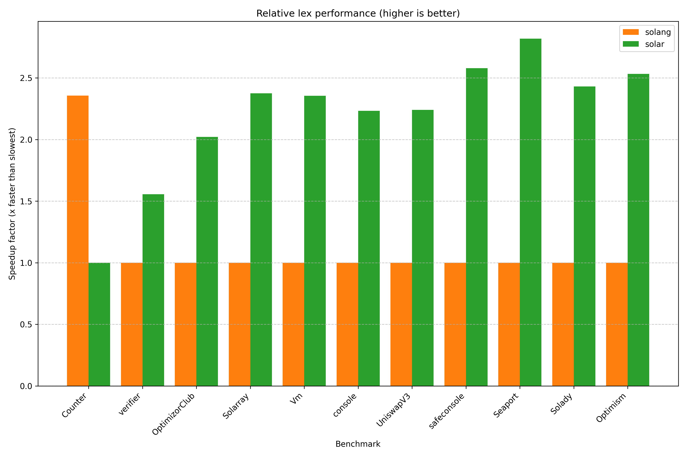

# solar-bench

Simple benchmarks across different Solidity parser implementations.

Requires cloning submodules: `git submodule update --init --checkout`.

Run with:

```bash
# Criterion
cargo criterion -p solar-bench --bench criterion -- --quiet --format terse |& tee benches/criterion.out
uv --project benches/analyze run benches/analyze/main.py benches/README.md < benches/criterion.out

# iai - requires `valgrind` and `iai-callgrind-runner`
cargo bench -p solar-bench --bench iai
```

This crate is excluded from the main workspace to avoid compiling it (and its dependencies) when
invoking other commands such as `cargo test`.

## Results

You view the Solar-only results on [codspeed.io](https://codspeed.io/paradigmxyz/solar).

The following results were achieved on:
- Target: `x86_64-unknown-linux-gnu`
- CPU: AMD Ryzen 9 7950X;
- Versions:
  - `solc 0.8.28`
  - `solar 0.1.2`
  - `solang-parser 0.3.4`
  - `slang 0.18.3`

<!-- AUTOGENERATED MARKER -->




### empty (0 LoC, 0 bytes)

#### Lex
| Parser   | Relative   | Time      | LoC/s   | Bytes/s   |
|:---------|:-----------|:----------|:--------|:----------|
| solang   | 17.29x     | 7.8917 ns | N/A     | N/A       |
| solar    | 1.00x      | 121.48 ns | N/A     | N/A       |

#### Parse
| Parser   | Relative   | Time      | LoC/s   | Bytes/s   |
|:---------|:-----------|:----------|:--------|:----------|
| solang   | 35.71x     | 94.198 ns | N/A     | N/A       |
| solar    | 7.99x      | 420.78 ns | N/A     | N/A       |
| solc     | 3.36x      | 1.0000 µs | N/A     | N/A       |
| slang    | 1.00x      | 3.3579 µs | N/A     | N/A       |

### Counter (14 LoC, 258 bytes)

#### Lex
| Parser   | Relative   | Time      | LoC/s   | Bytes/s   |
|:---------|:-----------|:----------|:--------|:----------|
| solar    | 1.44x      | 956.02 ns | 14.64M  | 269.87M   |
| solang   | 1.00x      | 1.3749 µs | 10.19M  | 187.77M   |

#### Parse
| Parser   | Relative   | Time      | LoC/s   | Bytes/s   |
|:---------|:-----------|:----------|:--------|:----------|
| solar    | 63.72x     | 2.8147 µs | 4.98M   | 91.68M    |
| solang   | 22.05x     | 8.1315 µs | 1.72M   | 31.73M    |
| solc     | 5.21x      | 34.400 µs | 406.98K | 7.50M     |
| slang    | 1.00x      | 179.30 µs | 78.08K  | 1.44M     |

### verifier (208 LoC, 11040 bytes)

#### Lex
| Parser   | Relative   | Time      | LoC/s   | Bytes/s   |
|:---------|:-----------|:----------|:--------|:----------|
| solar    | 1.59x      | 35.123 µs | 5.92M   | 314.32M   |
| solang   | 1.00x      | 55.949 µs | 3.72M   | 197.32M   |

#### Parse
| Parser   | Relative   | Time      | LoC/s   | Bytes/s   |
|:---------|:-----------|:----------|:--------|:----------|
| solar    | 107.82x    | 86.554 µs | 2.40M   | 127.55M   |
| solang   | 23.46x     | 397.85 µs | 522.81K | 27.75M    |
| solc     | 14.85x     | 628.50 µs | 330.95K | 17.57M    |
| slang    | 1.00x      | 9.3324 ms | 22.29K  | 1.18M     |

### OptimizorClub (782 LoC, 35905 bytes)

#### Lex
| Parser   | Relative   | Time      | LoC/s   | Bytes/s   |
|:---------|:-----------|:----------|:--------|:----------|
| solar    | 1.58x      | 114.74 µs | 6.82M   | 312.92M   |
| solang   | 1.00x      | 180.88 µs | 4.32M   | 198.50M   |

#### Parse
| Parser   | Relative   | Time      | LoC/s   | Bytes/s   |
|:---------|:-----------|:----------|:--------|:----------|
| solar    | 96.15x     | 264.90 µs | 2.95M   | 135.54M   |
| solang   | 21.34x     | 1.1937 ms | 655.11K | 30.08M    |
| solc     | 16.31x     | 1.5618 ms | 500.70K | 22.99M    |
| slang    | 1.00x      | 25.471 ms | 30.70K  | 1.41M     |

### UniswapV3 (3189 LoC, 146583 bytes)

#### Lex
| Parser   | Relative   | Time      | LoC/s   | Bytes/s   |
|:---------|:-----------|:----------|:--------|:----------|
| solar    | 1.86x      | 337.20 µs | 9.46M   | 434.71M   |
| solang   | 1.00x      | 627.84 µs | 5.08M   | 233.47M   |

#### Parse
| Parser   | Relative   | Time      | LoC/s   | Bytes/s   |
|:---------|:-----------|:----------|:--------|:----------|
| solar    | 101.30x    | 683.97 µs | 4.66M   | 214.31M   |
| solang   | 22.23x     | 3.1175 ms | 1.02M   | 47.02M    |
| solc     | 14.48x     | 4.7865 ms | 666.25K | 30.62M    |
| slang    | 1.00x      | 69.289 ms | 46.02K  | 2.12M     |

### Solarray (1544 LoC, 35898 bytes)

#### Lex
| Parser   | Relative   | Time      | LoC/s   | Bytes/s   |
|:---------|:-----------|:----------|:--------|:----------|
| solar    | 1.31x      | 202.24 µs | 7.63M   | 177.50M   |
| solang   | 1.00x      | 265.32 µs | 5.82M   | 135.30M   |

#### Parse
| Parser   | Relative   | Time      | LoC/s   | Bytes/s   |
|:---------|:-----------|:----------|:--------|:----------|
| solar    | 121.06x    | 532.56 µs | 2.90M   | 67.41M    |
| solc     | 28.68x     | 2.2478 ms | 686.89K | 15.97M    |
| solang   | 25.88x     | 2.4914 ms | 619.73K | 14.41M    |
| slang    | 1.00x      | 64.473 ms | 23.95K  | 556.79K   |

### console (1552 LoC, 67315 bytes)

#### Lex
| Parser   | Relative   | Time      | LoC/s   | Bytes/s   |
|:---------|:-----------|:----------|:--------|:----------|
| solar    | 1.39x      | 290.45 µs | 5.34M   | 231.76M   |
| solang   | 1.00x      | 403.15 µs | 3.85M   | 166.97M   |

#### Parse
| Parser   | Relative   | Time      | LoC/s   | Bytes/s   |
|:---------|:-----------|:----------|:--------|:----------|
| solar    | 105.92x    | 646.61 µs | 2.40M   | 104.10M   |
| solang   | 21.55x     | 3.1785 ms | 488.28K | 21.18M    |
| solc     | 20.20x     | 3.3913 ms | 457.64K | 19.85M    |
| slang    | 1.00x      | 68.491 ms | 22.66K  | 982.83K   |

### Vm (1763 LoC, 91405 bytes)

#### Lex
| Parser   | Relative   | Time      | LoC/s   | Bytes/s   |
|:---------|:-----------|:----------|:--------|:----------|
| solar    | 1.98x      | 190.64 µs | 9.25M   | 479.46M   |
| solang   | 1.00x      | 376.59 µs | 4.68M   | 242.72M   |

#### Parse
| Parser   | Relative   | Time      | LoC/s   | Bytes/s   |
|:---------|:-----------|:----------|:--------|:----------|
| solar    | 52.69x     | 350.93 µs | 5.02M   | 260.47M   |
| solang   | 13.52x     | 1.3681 ms | 1.29M   | 66.81M    |
| solc     | 7.38x      | 2.5056 ms | 703.62K | 36.48M    |
| slang    | 1.00x      | 18.492 ms | 95.34K  | 4.94M     |

### safeconsole (13248 LoC, 397898 bytes)

#### Lex
| Parser   | Relative   | Time      | LoC/s   | Bytes/s   |
|:---------|:-----------|:----------|:--------|:----------|
| solar    | 1.39x      | 1.5289 ms | 8.67M   | 260.25M   |
| solang   | 1.00x      | 2.1305 ms | 6.22M   | 186.76M   |

#### Parse
| Parser   | Relative   | Time      | LoC/s   | Bytes/s   |
|:---------|:-----------|:----------|:--------|:----------|
| solar    | 87.51x     | 4.6605 ms | 2.84M   | 85.38M    |
| solang   | 22.30x     | 18.287 ms | 724.45K | 21.76M    |
| solc     | 19.59x     | 20.822 ms | 636.25K | 19.11M    |
| slang    | 1.00x      | 407.85 ms | 32.48K  | 975.60K   |
